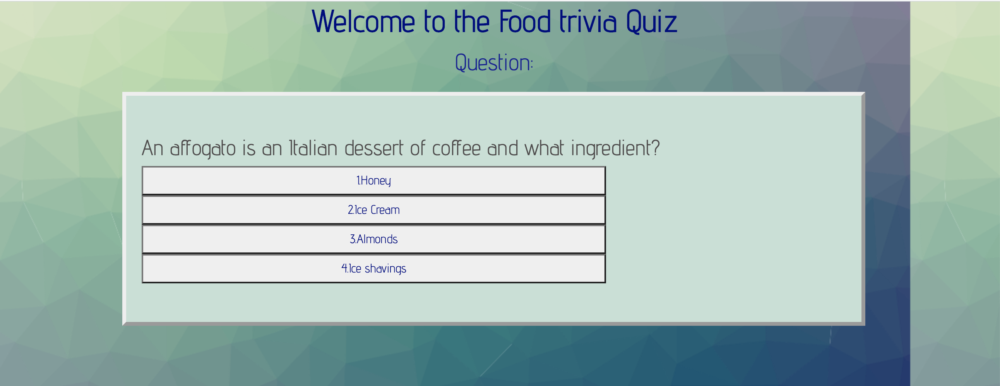

# codeQuiz

This application was quite challenging for me. The idea is to have a quiz that starts after attaching a listening event to a Start Quiz button. The questions should cycle through as the user clicks on the different choice button presented to them with each question. There will be a timer on the screen for two minutes. The less time the user completes the quiz in, the better score. At the end of the quiz they will be asked to input their initials and have them saved in the local storage of the application along with their socre.

Even though this is a fun activity to bring to life, I am still struggling with pulling all the components together to have a functioning product. This is a work in progress that is very close to be wrapped up

**_URL of deployed application:_**
[Code Quiz] (https://amoseman1.github.io/codeQuiz/)

**_The following image shows the web application's appearance and functionality:_**

